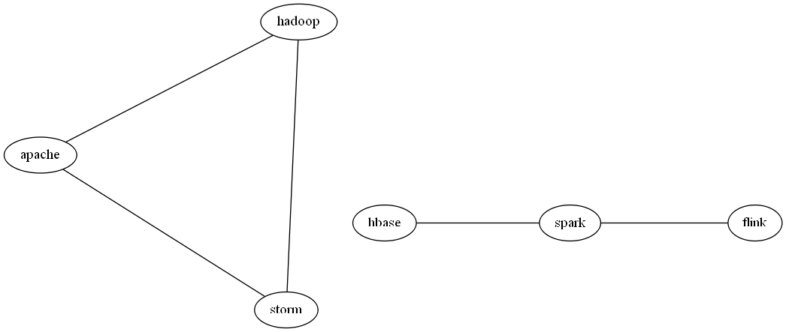

Insight Data Engineering - Coding Challenge
===========================================================

## Challenge Summary

This repository is my implementation of the two features of the challange requirements.

Feature 1: Clean and extract the text from the raw JSON tweets that come from the Twitter Streaming API, and track the number of tweets that contain unicode.

Feature 2: Calculate the average degree of a vertex in a Twitter hashtag graph for the last 60 seconds, and update this each time a new tweet appears.

## Details of Implementation

I have implemented both features as stand-alone programs in case the end-user would like to utilize only one.
Both programs take 2 arguments (input file, output file).

e.g. python ./src/tweets_cleaned.py ./tweet_input/tweets.txt ./tweet_output/ft1.txt

It is assumed that the input file is a text document with each line containing JSON of tweet from the Twitter API.

Expected tweets.txt file format:

	{JSON of first tweet}  
	{JSON of second tweet}  
	{JSON of third tweet}  
	.
	.
	.
	{JSON of last tweet}  

## First Feature

The first feature parses the text portion of the tweet. Removes all unicode characters and formats the text with timetamp as instructed in the requirements.
The script also counts the number of tweets that contained unicode characters and outputs the value at the end of the text file.

In addition to unicode characters, I have also removed common special html encodings from the tweets text portion ('&gt;'  "&amp;" etc.)

## Second Feature
The second feature will continually update the Twitter hashtag graph and hence, the average degree of the graph. The graph should just be built using tweets that arrived in the last 60 seconds as compared to the timestamp of the latest tweet. As new tweets come in, edges formed with tweets older than 60 seconds from the timstamp of the latest tweet should be evicted. For each incoming tweet, only extract the following fields in the JSON response
* "hashtags" - hashtags found in the tweet
* "created_at" - timestamp of the tweet

### Building the Twitter Hashtag Graph

I implemented an additional feature by generating the graph for the latests tweet using [Graphviz](http://www.graphviz.org/)

When run for the following input:

```
Spark Summit East this week! #Spark #Apache (timestamp: Thu Oct 29 17:51:01 +0000 2015)
Just saw a great post on Insight Data Engineering #Apache #Hadoop #Storm (timestamp: Thu Oct 29 17:51:30 +0000 2015)
Doing great work #Apache (timestamp: Thu Oct 29 17:51:55 +0000 2015)
Excellent post on #Flink and #Spark (timestamp: Thu Oct 29 17:51:56 +0000 2015)
New and improved #HBase connector for #Spark (timestamp: Thu Oct 29 17:51:59 +0000 2015)
New 2.7.1 version update for #Hadoop #Apache (timestamp: Thu Oct 29 17:52:05 +0000 2015)
```

The script generates the following graph:



When run for the data-gen/tweets.txt file in the instructions, the script produces the following output:


Please keep in mind, the script generates the graph for the last tweet (and all the tweets that are within the threshold time period of the last tweet). Generating a graph for every tweet in the input file seemed illogical and impractical.

Average_degree.py outputs a formatted text file graphviz.txt to the tweet_output folder. 
The graph is generated by feeding graphviz.txt to sfdp command with the following line "sfdp -Tpng ./tweet_output/graphviz.txt -o ./tweet_output/graph.png -Gcharset=latin1" line in the run.sh. If the sfdp(graphviz) is not installed, the script tries to install it with a sudo pip install command.

## Repo directory structure
	├── README.md  
	├── run.sh  
	├── src  
	│   ├── average_degree.py  
	│   └── tweets_cleaned.py  
	├── tweet_input  
	│   └── tweets.txt  
	└── tweet_output  
	    ├── ft1.txt  
	    └── ft2.txt  


